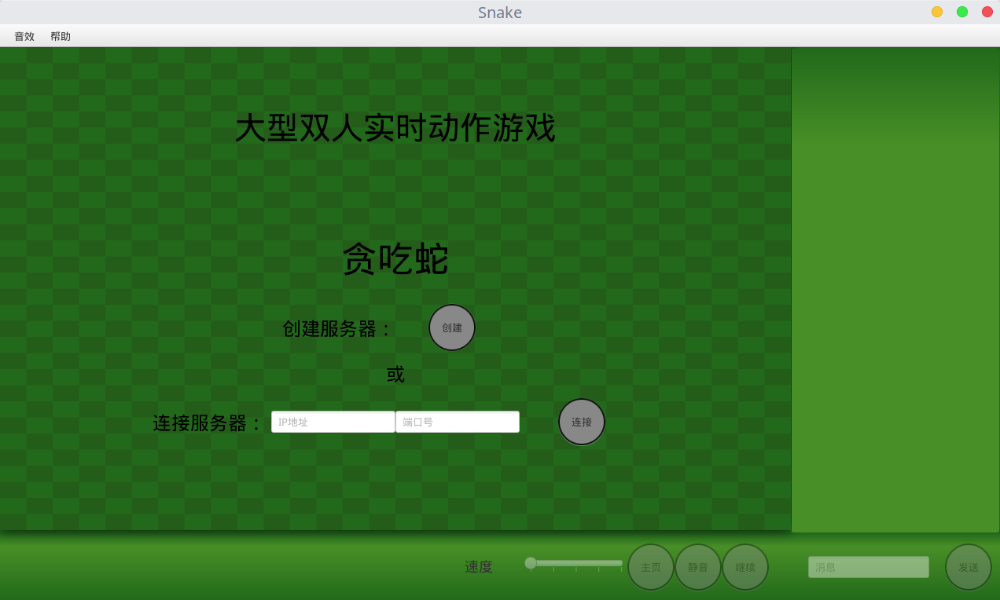
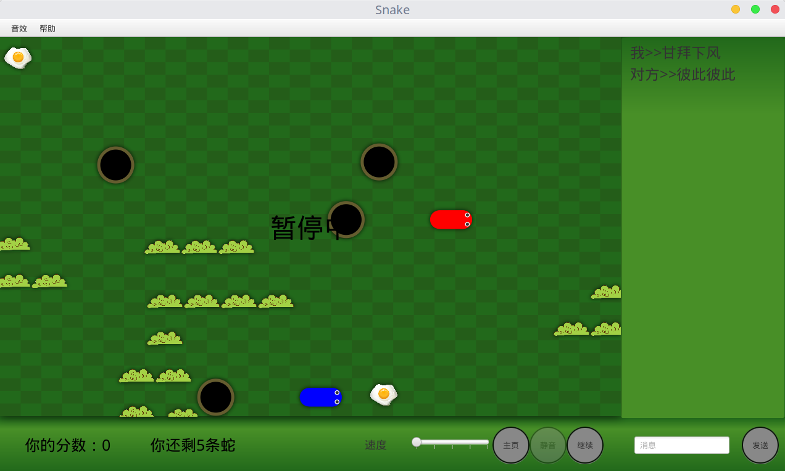

# SnakeFX

## Introduction

SnakeFX is a [snake](https://en.wikipedia.org/wiki/Snake_(video_game_genre)) game written in java, a two-player game with ugly UI that can be played over network, and it supports user-specified BGM and instant messaging. It is a homework project for summer semester with awful code style. In CS department of Tsinghua University, it is a tradition to ask students to write some stupid games using a language they have just learnt for one week or two in summer semester. But for this stupid homework, I should have been tralleling around Taiwan now. So this is really a sad story.

This project uses javafx framework (which is more modern than the swing framework introduced in the textbook) and netty (an event-driven network application framework) to make it easier to code.

## Build

Because I'm not familiar with any of java's build tools, I just used ItelliJ Idea, which turned to be an excellent IDE. I include Idea project files in this repo, you can just use them to build this project.

## Screenshots

